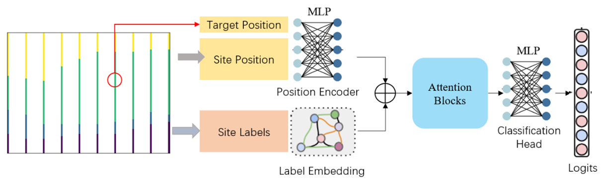
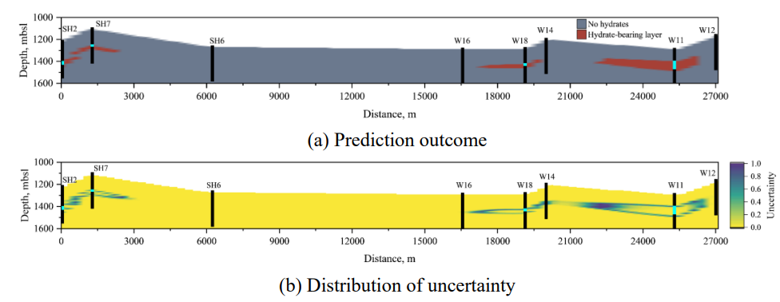

# Official repository of self-attention-based geographical interpolation deep learning (GiDL) framework

- [Introduction](#introduction)
- [Installation](#installation)
- [Data preparation](#data-preparation)
- [Training](#training)
- [Inference](#inference)

## Introduction
Inferring and delineating the subsurface stratigraphy of unexplored areas in deep sea remains a challenging problem. This is mainly due to insufficient prior geological knowledge, the inherent complexity of stratigraphy, and spatial variability coupled with the scarcity of drilling boreholes. For existing deep-learning approaches, it is possible to learn the mapping between sparse borehole data and stratigraphic structures while the solution quality largely depends on the prior physics knowledge and proper setting of hyperparameters. Self-attention-based geographical interpolation deep learning (GIDL) framework is developed to facilitate learning of highly complex stratigraphic structures in sparse borehole regions.




## Installation
* Create a conda environment
```
conda create -n GIDL python=3.8
conda activate GIDL
git clone 
```
* Install packages
```
pip install -r requirements.txt
```

## Data preparation


* Data without coordinates
If your data are grids in a matrix, store your data in `.csv` or `.npy` file and specify task as `Transformer` in training.

* Data with coordinates
If your data come with coordinates, store data in `.csv` file. The columns are x, y, z coordinates, label of sample at this coordinate, and the name of borehole. Specify task as `TransformerBH` in training 

Then put the csv file in `./dataset` folder or create a soft link under `./dataset` pointing to this file.

## Training
```
python ./tools/train_bh.py --gpu-id <id-of-gpu-to-be-used-for-training> --root <root-dir-of-project> --task <task-name-either-Transformer-or-TransformerBH> --task-subdir <experiments-name> --data-root <root-dir-to-dataset> --data-file <file-name-of-data> --valid-size <ratio-of-data-for-validation> --shuffle-site <shuffle-training-data> --batch-size <batch-size-for-training> --test-batch-size <batch-size-for-testing-or-inference> --test-site <names-of-boreholes-used-for-test-or-inference-splitted-using-,> --epochs <number-of-training-epochs> --init-lr <initial-learning-rate> --warmup-ratio <ratio-of-total-steps-of-warming-up> --decay-order <order-of-learning-rate-decay> --betas <betas-for-Adam-optimizer> --eps <eps-for-Adam-optimizer> --cls-encoding <type-of-label-encoding-method-MLP-or-Embedding> --cls-encoding-p <dropout-probability-of-label-encoding-method> --pos-encoding <type-of-position-encoding-method> --pos-encoding-p <dropout-probability-of-position-encoding> --n-cls <number-of-labels> --site-dim <dimension-of-site> --act-name <name-of-activation-function> --embed-dim <dimension-of-embedding> --depth <number-of-blocks> --n-heads <number-of-attention-heads> --forward-expansion <expansion-ratio-of-MLP> --p <dropout-probability-of-MLP> --attn-p <dropout-ratio-of-attention-layer>
```

## Inference 
```
python ./tools/infer_bh.py --n-grids <number-of-grids-for-each-axis> --lower-bound-grids <lower-bound-for-each-axis> --upper-bound-grids <upper-bound-for-each-axis> --ckpt-file <model-checkpoint>
```

## Key features
### Class imbalance
Use a dataloader that can compute the weight of each class and sample using computed weights to address the problem of class imbalance.
### Data preprocessing
Transform coordinates of borehole samples to avoid instability and improve robustness of the model.
### Self-attention based deep learning model
The coordinates and labels of the boreholes are encoded into vectors and then the characteristics of the site is learned using stacked attention blockes.
### Uncertainty quantification
The uncertainty of the predictions is quantified using estimated variance, which can be effectively applied to reducing engineering and environmental. 


